# PolicyPulse AI — Architecture Diagram Prompt

Use this prompt with **Eraser.io**, **Miro**, **Lucidchart AI**, **Mermaid Live Editor**, or any AI diagramming tool.

---

## Prompt (copy-paste into your diagramming AI)

```
Create a modern, detailed system architecture diagram for "PolicyPulse AI" — an AI-powered compliance monitoring SaaS platform. Include the following layers and components with clearly labeled connections:

[USER LAYER]
- Admin User
- Compliance Officer  
- Viewer User

[FRONTEND LAYER — React + Vite on port 3000]
- Login Page (JWT Auth)
- Dashboard (Compliance Score, AI Overview, Violation Charts)
- Policies Page (PDF Upload, Demo Policy button)
- Records Page (Employee / Server / Vendor / Data Store records)
- Violations Page (Severity tracking: Critical / High / Medium / Low)
- Reports Page (AI-generated reports)
- Users Page (Role management)
- Global AI Chatbot (floating, Gemini-powered)

[API GATEWAY LAYER — FastAPI on port 8000]
- POST /api/auth/login · POST /api/auth/register
- GET|POST /api/policies/* (upload PDF, demo-upload, list, delete)
- GET|POST /api/records/* (CRUD for all record types)
- GET|POST /api/violations/* (CRUD + status workflow)
- GET /api/dashboard/* (metrics, compliance score, trends)
- POST /api/ai/chat (chatbot with live context)
- GET /api/ai/overview (agentic executive summary)
- GET /api/ai/questions (predefined questions)
- POST /api/ai/analyze-text (text snippet analysis)

[SERVICES LAYER — Python]
- ai_service.py → Google Gemini 1.5 Flash
  - chat_with_compliance_ai()
  - generate_compliance_overview()
  - extract_rules_from_policy()
  - generate_demo_rules_with_ai()
  - analyze_pdf_with_ai()
- auth_service.py → JWT token management
- rule_engine.py → Rule evaluation engine (evaluates records against rules)
- scheduler.py → APScheduler (auto-scan every 30 minutes)
- pdf_parser.py → PyPDF2 text extraction

[AI LAYER — Google Gemini 1.5 Flash]
- PDF Rule Extraction (temperature 0.3)
- AI Chatbot with Live Context (temperature 0.5)
- Executive Compliance Overview (temperature 0.4)
- Demo Rule Generation (temperature 0.7)

[DATABASE LAYER — MongoDB]
- Collections: users, policies, rules, records, violations, scan_history

[STORAGE LAYER]
- Local file storage: backend/uploads/ (PDF files)

Draw connections:
- Frontend → FastAPI (REST/JSON over HTTP)
- FastAPI → MongoDB (Motor async driver)
- FastAPI → Gemini API (google-generativeai SDK, HTTPS)
- FastAPI → Local Storage (PDF read/write)
- Scheduler → Rule Engine → MongoDB (periodic auto-scan)

Style: Dark theme, color-coded layers (blue for frontend, green for backend, orange for AI, purple for database). Use rounded rectangle boxes, arrow labels, and include the tech names as sub-labels under component names.
```

---

## Mermaid Diagram (paste at https://mermaid.live)

```mermaid
graph TB
    subgraph Users["👤 Users"]
        A[Admin] 
        B[Compliance Officer]
        C[Viewer]
    end

    subgraph Frontend["🖥 Frontend — React + Vite :3000"]
        D[Dashboard]
        E[Policies]
        F[Records]
        G[Violations]
        H[AI Chatbot]
        I[Reports]
    end

    subgraph Backend["⚙️ Backend — FastAPI :8000"]
        J[Auth Routes]
        K[Policy Routes]
        L[Record Routes]
        M[Violation Routes]
        N[Dashboard Routes]
        O[AI Routes]
    end

    subgraph Services["🔧 Services"]
        P[AI Service]
        Q[Rule Engine]
        R[Scheduler]
        S[PDF Parser]
    end

    subgraph AI["🤖 Google Gemini 1.5 Flash"]
        T[Chat]
        U[Overview]
        V[Rule Extraction]
        W[Demo Generation]
    end

    subgraph DB["🗄 MongoDB — policypulse"]
        X[(users)]
        Y[(policies)]
        Z[(rules)]
        AA[(records)]
        BB[(violations)]
    end

    Users --> Frontend
    Frontend --> Backend
    Backend --> Services
    Services --> AI
    Services --> DB
    Backend --> DB
```


